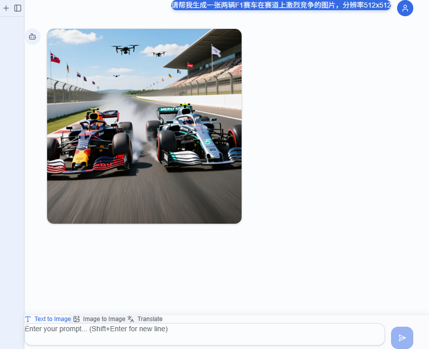

# QwenImager

A cross-platform desktop application for AI image generation powered by Qwen (Tongyi Wanxiang) APIs. Built with Tauri v2 for a lightweight and performant experience.

一款基于 Qwen（通义万象）API 的跨平台桌面 AI 图像生成应用。使用 Tauri v2 构建，轻量且高性能。



---

## Features | 功能特性

- **Text-to-Image** | 文生图 - Generate images from text prompts
- **Image-to-Image** | 图生图 - Edit and transform images with AI
- **Image Translation** | 图片翻译 - Translate text within images to different languages
- **Conversation History** | 历史记录 - Browse and restore previous conversations
- **Clipboard Support** | 剪贴板支持 - Paste images directly with Ctrl+V
- **Drag & Drop** | 拖拽上传 - Drag images to upload for image editing

---

## Installation | 安装

### Download Pre-built Binaries | 下载预编译版本

Coming soon... | 即将推出...

### Build from Source | 从源码编译

#### Prerequisites | 前置要求

- **Node.js** >= 18.x
- **pnpm** (recommended) or npm
- **Rust** (stable, latest)
- **Platform-specific dependencies**:
  - **Windows**: Microsoft Visual Studio C++ Build Tools
  - **macOS**: Xcode Command Line Tools
  - **Linux**: `libwebkit2gtk-4.1-dev`, `libappindicator3-dev`, `librsvg2-dev`, etc.

#### Steps | 步骤

1. **Clone the repository | 克隆仓库**

   ```bash
   git clone https://github.com/your-username/QwenImager.git
   cd QwenImager
   ```

2. **Install frontend dependencies | 安装前端依赖**

   ```bash
   pnpm install
   ```

3. **Run in development mode | 开发模式运行**

   ```bash
   cargo tauri dev
   ```

4. **Build for production | 生产构建**

   ```bash
   cargo tauri build
   ```

   The built application will be in `src-tauri/target/release/bundle/`.
   
   构建完成的应用程序位于 `src-tauri/target/release/bundle/` 目录。

---

## Configuration | 配置

QwenImager reads configuration from `~/.qwenimage/setting.json`. You must create this file with your API credentials before using the application.

QwenImager 从 `~/.qwenimage/setting.json` 读取配置。使用应用前，您需要创建此文件并填入 API 凭证。

### Configuration File Location | 配置文件位置

| Platform | Path |
|----------|------|
| Windows  | `C:\Users\<username>\.qwenimage\setting.json` |
| macOS    | `/Users/<username>/.qwenimage/setting.json` |
| Linux    | `/home/<username>/.qwenimage/setting.json` |

### Basic Configuration Example | 基础配置示例

```json
{
  "providers": {
    "qwen": {
      "apiKey": "sk-your-api-key-here",
      "models": {
        "qwen-image-max": {
          "url": "https://dashscope.aliyuncs.com/api/v1/services/aigc/multimodal-generation/generation",
          "service_type": "text2img",
          "mode": "sync",
          "supports_size": true,
          "response_format": "url",
          "response_image_path": "output.choices[*].message.content[*].image",
          "request_template": {
              "model": "{model}",
              "input": {
                  "messages": [
                  {
                      "role": "user",
                      "content": [{"text": "{prompt}"}]
                  }
                  ]
              },
              "parameters": { "size": "{size}" }
          }
        },
        "wan2.6-image": {
            "url": "https://dashscope.aliyuncs.com/api/v1/services/aigc/multimodal-generation/generation",
            "service_type": "img2img",
            "mode": "sync",
            "supports_size": true,
            "response_image_path": "output.choices[*].message.content[*].image",
            "request_template": {
                "model": "{model}",
                "input": {
                    "messages": [
                    {
                        "role": "user",
                        "content": [{"text": "{prompt}"}]
                    }
                    ]
                },
                "parameters": { "n": 1, "size": "{size}" }
            }
        },
        "qwen-mt-image": {
            "url": "https://dashscope.aliyuncs.com/api/v1/services/aigc/image2image/image-synthesis",
            "service_type": "translate",
            "mode": "async_poll",
            "async_poll": {
                "submit_headers": { "X-DashScope-Async": "enable" },
                "poll_url": "https://dashscope.aliyuncs.com/api/v1/tasks/{task_id}"
            }
        }
      }
    }
  }
}
```

### Configuration Options | 配置选项

#### Provider Configuration | Provider 配置

| Field | Type | Required | Description |
|-------|------|----------|-------------|
| `apiKey` | string | Yes | Your API key from Alibaba Cloud DashScope |
| `models` | object | Yes | Map of model name to model configuration |

#### Model Configuration | 模型配置

| Field | Type | Required | Default | Description |
|-------|------|----------|---------|-------------|
| `url` | string | Yes | - | API endpoint URL |
| `service_type` | string | No | Inferred from model name | One of: `text2img`, `img2img`, `translate` |
| `mode` | string | No | `sync` | API mode: `sync` or `async_poll` |
| `request_template` | object | No | Built-in template | Custom JSON request body template |
| `response_image_path` | string | No | Built-in path | JSONPath to extract image data from response |
| `response_format` | string | No | `url` | Response format: `url` (image URLs) or `base64` (inline base64 data) |
| `headers` | object | No | `{}` | Extra headers to include in requests |
| `async_poll` | object | No* | - | Required when `mode` is `async_poll` |

#### Async Poll Configuration | 异步轮询配置

| Field | Type | Required | Default | Description |
|-------|------|----------|---------|-------------|
| `submit_headers` | object | No | `{}` | Extra headers for the submit request |
| `poll_url` | string | Yes | - | URL template with `{task_id}` placeholder |
| `poll_interval_secs` | number | No | `3` | Seconds between poll requests |
| `timeout_secs` | number | No | `180` | Total timeout before giving up |

---

## Supported Models | 支持的模型

QwenImager is designed to work with Alibaba Cloud's Qwen (Tongyi) image generation APIs. Below are the officially supported models:

QwenImager 设计用于配合阿里云通义万象图像生成 API。以下是官方支持的模型：

### Text-to-Image | 文生图

| Model | Description |
|-------|-------------|
| `qwen-image-max` | High-quality image generation from text prompts |
| `wan2.6-t2i` | Beautiful image generation |
| `qwen-image-plus` | Balanced quality and speed |
| `z-image-turbo` | lightweight image generation model |

### Image-to-Image | 图生图

| Model | Description |
|-------|-------------|
| `qwen-image-edit-max` | Image editing with multimodal understanding |
| `wan2.6-image` | Image editing with multimodal understanding |

### Image Translation | 图片翻译

| Model | Description |
|-------|-------------|
| `qwen-mt-image` | Translate text within images |

> **Note**: Model availability depends on your DashScope subscription. Please check [Alibaba Cloud DashScope](https://dashscope.aliyun.com/) for the latest model offerings.
>
> **注意**：模型可用性取决于您的 DashScope 订阅。请查看[阿里云 DashScope](https://dashscope.aliyun.com/) 获取最新模型信息。

---

## Third-Party API Support | 第三方 API 支持

QwenImager supports any OpenAI-compatible or custom image generation API through its flexible configuration system.

QwenImager 通过灵活的配置系统支持任何 OpenAI 兼容或自定义的图像生成 API。

**Available content placeholders for img2img | 图生图可用的内容占位符**:

| Placeholder | Format | Use Case |
|-------------|--------|----------|
| `{content}` | `[{image: "..."}, {text: "..."}]` | DashScope API |
| `{openai_content}` | `[{type: "image_url", image_url: {url: "..."}}, {type: "text", text: "..."}]` | OpenAI/LiteLLM |
| `{gemini_parts}` | `[{inlineData: {mimeType: "...", data: "..."}}, {text: "..."}]` | Direct Vertex AI |

### Google Gemini (Direct Vertex AI)

For direct Vertex AI access, Gemini returns images as base64-encoded `inlineData`. Use `response_format: "base64"`:

对于直接访问 Vertex AI，Gemini 以 base64 编码的 `inlineData` 返回图像。使用 `response_format: "base64"`：

```json
{
  "providers": {
    "vertex": {
      "apiKey": "your-gcloud-access-token",
      "models": {
        "gemini-2.0-flash-preview-image-generation": {
          "url": "https://us-central1-aiplatform.googleapis.com/v1/projects/YOUR_PROJECT/locations/us-central1/publishers/google/models/gemini-2.0-flash-preview-image-generation:generateContent",
          "service_type": "text2img",
          "mode": "sync",
          "response_format": "base64",
          "response_image_path": "candidates[*].content.parts[*].inlineData",
          "request_template": {
            "contents": {
              "role": "user",
              "parts": [
                {
                  "text": "{prompt}"
                }
              ]
            },
            "generationConfig": {
              "responseModalities": ["TEXT", "IMAGE"]
            }
          }
        }
      }
    }
  }
}
```

### Multiple Providers | 多个 Provider

You can configure multiple providers simultaneously. The application will use the first available model matching the requested service type:

您可以同时配置多个 provider。应用程序将使用第一个匹配请求服务类型的可用模型：

```json
{
  "providers": {
    "qwen": {
      "apiKey": "sk-qwen-key",
      "models": { ... }
    },
    "gemini": {
      "apiKey": "gemini-key", 
      "models": { ... }
    }
  }
}
```

---

## Tech Stack | 技术栈

- **Frontend**: React 19, TypeScript 5.x, Tailwind CSS v4, shadcn/ui, Zustand
- **Backend**: Rust (stable), Tauri v2
- **Database**: SQLite (via rusqlite)
- **HTTP Client**: reqwest

---

## Project Structure | 项目结构

```
QwenImager/
├── src/                    # Frontend React source
│   ├── components/         # UI components
│   ├── stores/             # Zustand state management
│   └── lib/                # Utilities
├── src-tauri/              # Rust backend
│   ├── src/
│   │   ├── commands/       # Tauri command handlers
│   │   ├── models/         # Data structures
│   │   └── services/       # Business logic
│   └── Cargo.toml
├── package.json
└── tauri.conf.json
```

---

## Getting Your API Key | 获取 API Key

1. Visit [Alibaba Cloud DashScope](https://dashscope.aliyun.com/)
2. Sign up or log in to your account
3. Navigate to API Key management
4. Create a new API key and copy it to your configuration file

---

1. 访问 [阿里云 DashScope](https://dashscope.aliyun.com/)
2. 注册或登录您的账户
3. 进入 API Key 管理页面
4. 创建新的 API Key 并复制到配置文件中

---

## License | 许可证

MIT License

---

## Contributing | 贡献

Contributions are welcome! Please feel free to submit issues and pull requests.

欢迎贡献！请随时提交 Issue 和 Pull Request。
